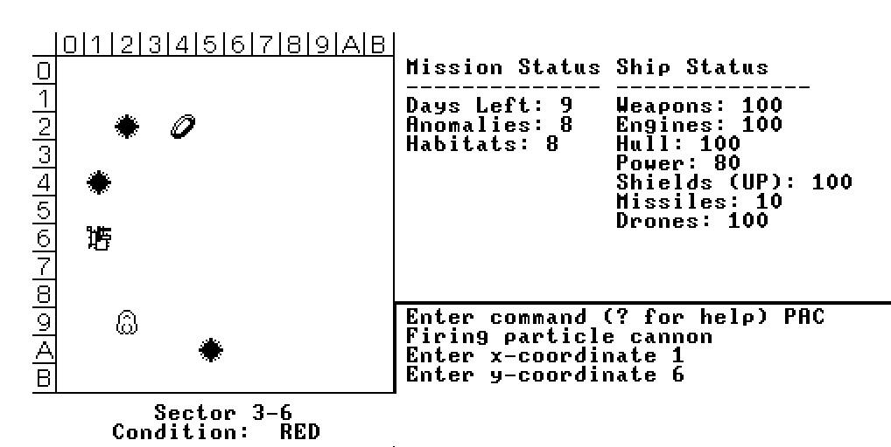
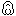
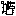
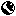
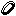
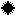

# Star Hack

Star Hack is an homage to classic "Trek" style games written for the Jack programming language.

# The game

You are tasked with defending an 8x8 region of space while managing your ship's resources.

Key:

 * Your ship: 
 * Anomaly: 
 * Planetary habitat: 
 * Orbital habitat: 
 * Star: 

# Running the code

This code makes use of a few Jack and VM extensions that aren't part of the Nand2Tetris course - mostly focused on reducing instruction counts in the compiled Hack assembly language. Without them the code as written simply wouldn't fit in the CPU simulator!

To build for the VM emulator (all VM extensions replaced with standard VM equivalents):

python3 lang/JackCompiler.py StarHack

To build for Hack

python3 lang/JackCompiler.py -x StarHack
python3 lang/VMTranslator.py  StarHack
python3 lang/asm.py  StarHack/StarHack.asm StarHack/StarHack.hack

# Links
 * https://www.nand2tetris.org/
 * https://en.wikipedia.org/wiki/Star_Trek_(1971_video_game)
